# DJs

Date de création: 17 mars 2025 21:36

<aside>
🔊

Nos DJs ne se contentent pas de passer de la musique, ils **créent une véritable expérience**. Avec **VIBRA**, nous garantissons des prestations de qualité en respectant **5 engagements essentiels** :

🎧 **Une énergie qui s’adapte à votre public**

Nos DJs savent **lire la foule** et ajuster leur set en temps réel pour maintenir une ambiance dynamique et immersive.

🎶 **Un mix fluide et une sélection musicale sur-mesure**

Chaque événement est unique. Nos DJs proposent des **playlists personnalisées** et des transitions parfaites pour une soirée sans fausse note.

🔊 **Un son et un show visuel de qualité**

Nous utilisons **du matériel professionnel** pour garantir une ambiance sonore et lumineuse à la hauteur de votre événement.

🤝 **Une prestation fiable et flexible**

Nos DJs sont **ponctuels, organisés et réactifs**. Ils s’adaptent à vos demandes et assurent une **prestation fluide et sans imprévus**.

🔥 **Une expérience mémorable**

Bien plus qu’une simple animation musicale, nos DJs créent **des moments inoubliables**, en apportant énergie et passion à chaque prestation.

📩 **Prêt à faire vibrer votre événement ? Contactez-nous dès maintenant !**

[⚡ Recevez votre devis personnalisé en moins de 24h](https://forms.gle/z8hR8e3A7QGao7Rc9)

</aside>

# Exemples de DJs avec qui nous travaillons

## Lucas – Fondateur de VIBRA – DJ & Producteur de Musique

---

comp.jpg)

comp.jpg)

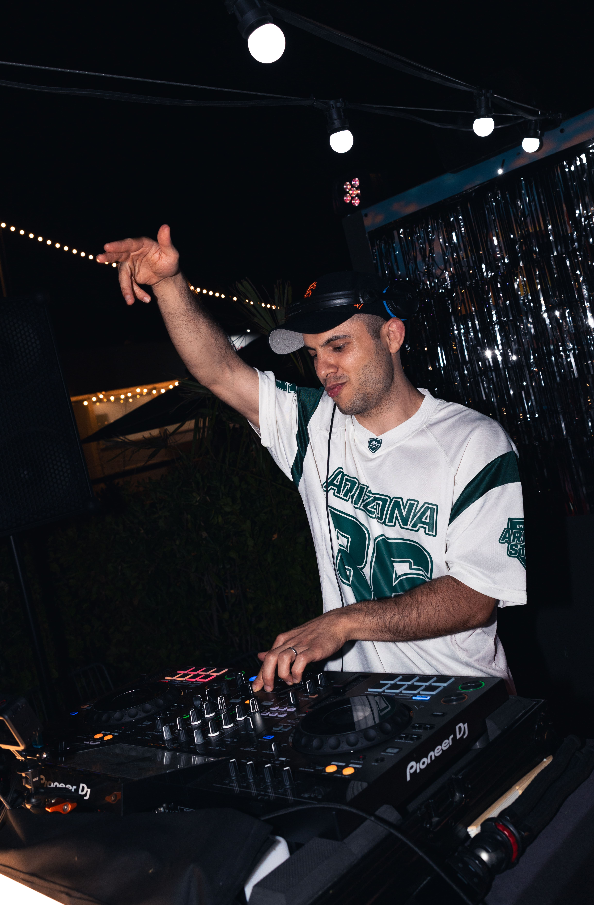

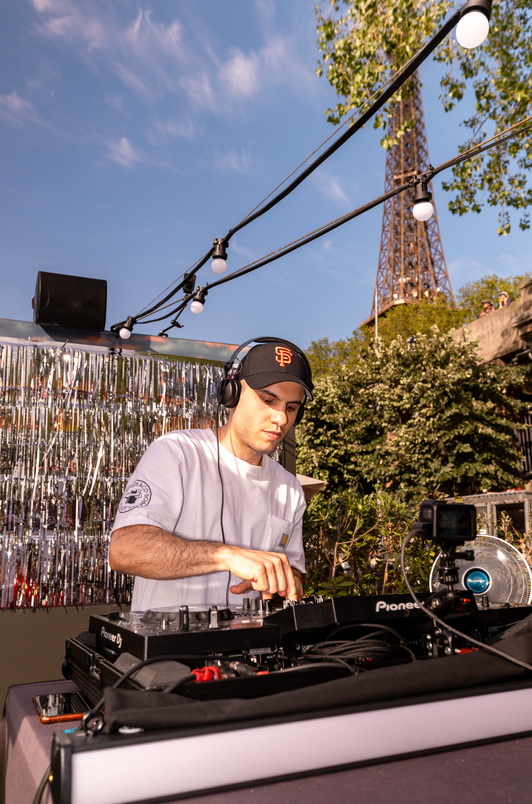

.jpg)

[https://youtube.com/shorts/p1zX7OXVOM4](https://youtube.com/shorts/p1zX7OXVOM4)

Passionné de musique depuis l’enfance, Lucas a grandi au rythme du **hip-hop** avant d’explorer l’univers de la **house et des grandes soirées étudiantes** durant ses études à l'ENSEIRB-MATMECA. Son parcours l'a amené à affiner un style **éclectique et varié**, capable de **faire vibrer n'importe quel public**.

🎶 **Polyvalence musicale** : 
Des **rythmes latinos enflammés** aux **sonorités électroniques percutantes**, en passant par les **hits commerciaux, rétros ou rap**, Lucas s’adapte à toutes les ambiances avec une sélection musicale toujours **dynamique et captivante**. Il possède un **background musical riche** et **produit ses propres morceaux et instrumentales**.

🌆 **Expérience solide** : 

DJ résident au **Toucan Fringant**, l’un des bars latinos incontournables de Bordeaux, il a activement **contribué à son développement**. Sa polyvalence l’a également conduit à se produire dans divers établissements renommés tels que le **Délirium Café**, **Le Bourbon**, **La Belle en Folie** le **Vice Versa** (**Paris & Marseille**) ou **encore Lorganiq**.
Habitué des **événements privés et corporate**, il sait s’adapter à tous les contextes et a déjà mixé pour des **marques et institutions prestigieuses** comme **Société Générale**, **Hugo Boss** et **Cap Sciences**.

🎛️ **Expertise et vision** : 

Ingénieur en Intelligence Artificielle et Science des données de formation, Lucas met désormais **toute son énergie dans VIBRA**, qu'il a fondée pour **partager sa passion et sa vision de la musique** à travers des événements uniques.

📀 [**Découvrir ses morceaux et remixes**](https://soundcloud.com/ramel_fr) *(à titre d’information)*

---

## Leo Brown – DJ & Producteur de Musique

---

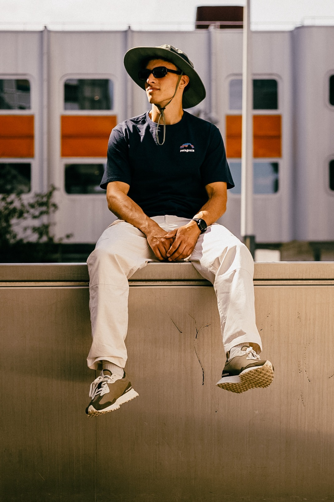

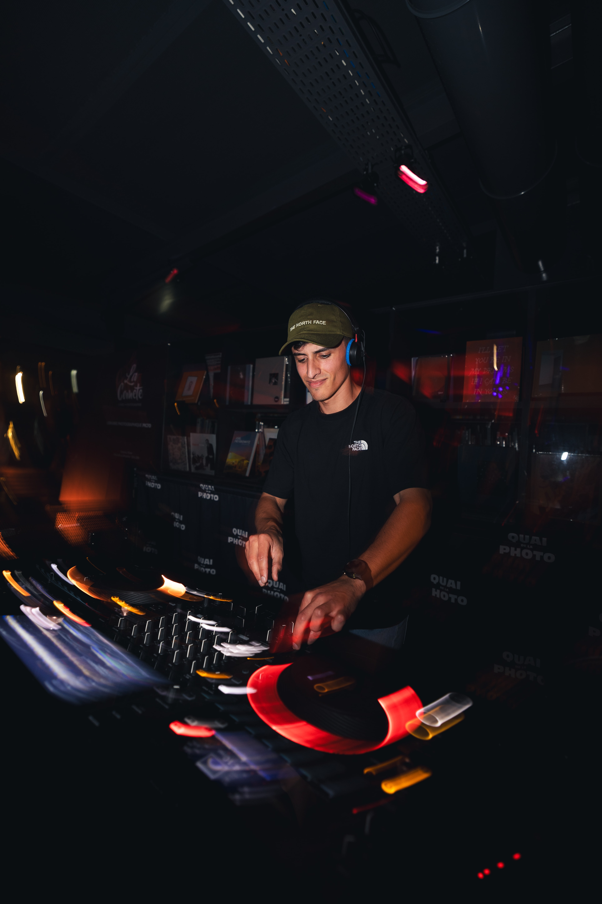

[https://youtube.com/shorts/v2AuH_LVh6w?feature=share](https://youtube.com/shorts/v2AuH_LVh6w?feature=share)

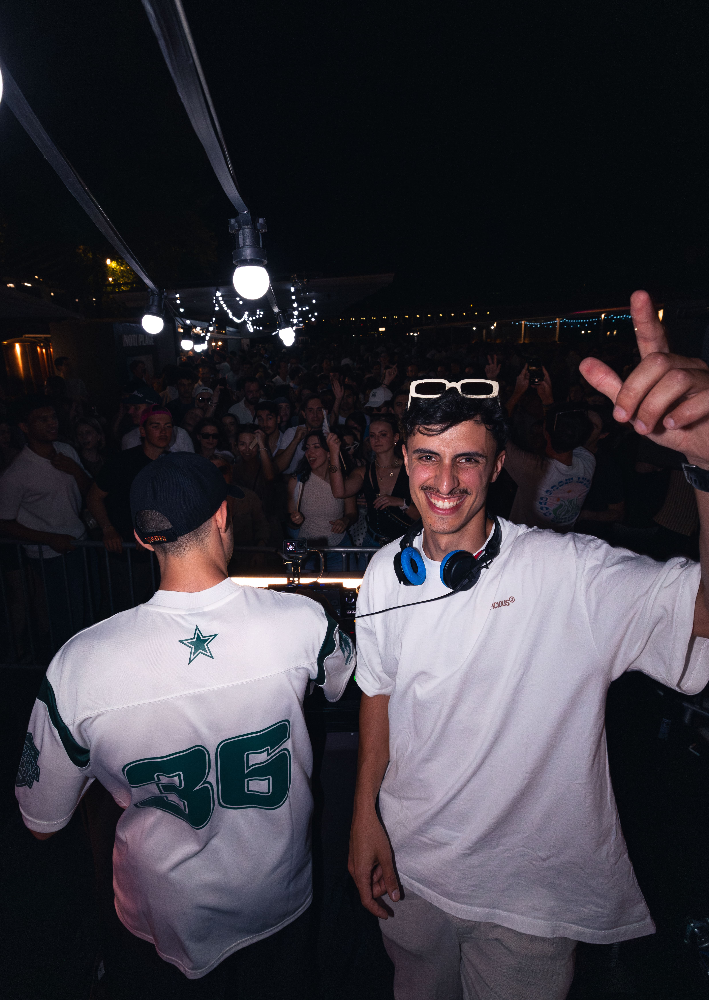

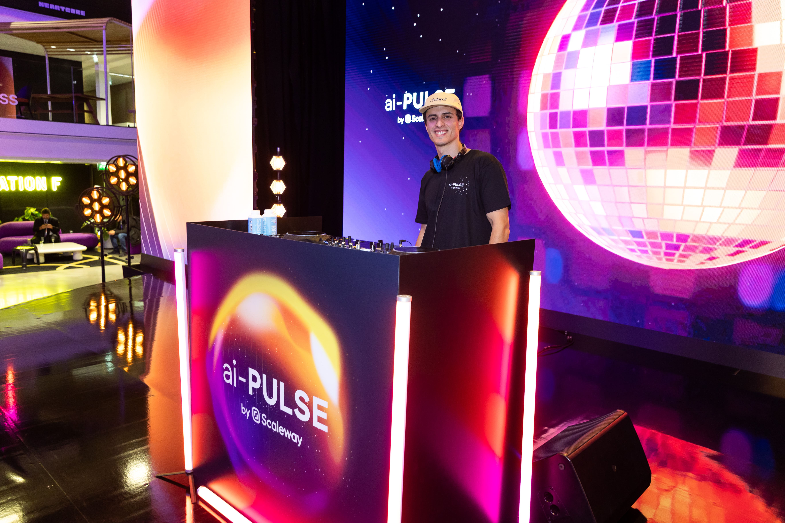

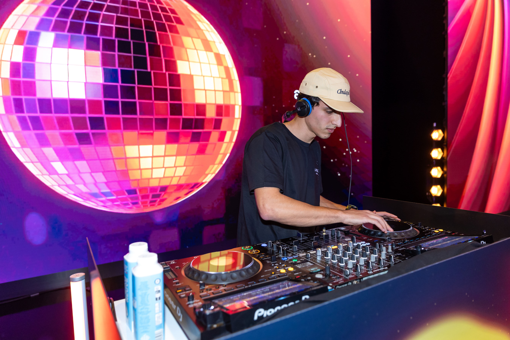

Formé à la même école d’ingénieur que Lucas, Léo est un **passionné de production musicale et d’animation de soirées**. Ensemble, ils ont organisé et animé **de grands événements étudiants**, ainsi que plusieurs **Fêtes de la Musique tous les ans depuis 2022**, développant une expertise solide en création d’ambiance et en gestion de la foule.

🌆 **Un habitué des rooftops parisiens** :
Véritable architecte du groove, Léo sait **faire danser n’importe quel public**, que ce soit dans les bars branchés, les soirées privées ou les événements corporate. On raconte même qu'il aurait "**inventé le groove**" lors d’un **coucher de soleil aux Invalides**. Il a notamment pu réaliser des prestations parisiennes pour **Station F** et le **Vice Versa**.

🎶 **Style et créativité** :

Avec un style oscillant entre **house, funk et rythmes disco**, il crée des sets à la fois **chaleureux, entraînants**, parfaits pour une ambiance à la fois festive et sophistiquée.

🎧 **Un artiste prolifique** :

Producteur actif, ses morceaux cumulent de nombreuses écoutes sur [**Spotify](https://open.spotify.com/intl-fr/artist/44NtFX5OfUfdUIVYoGE3ND)** et il enrichit continuellement son univers sonore avec des productions originales et des remixes innovants.

📀 [**Découvrir ses morceaux et remixes**](https://soundcloud.com/leobrownmusic) *(à titre d’information)*

---

## Pierre - DJ

---

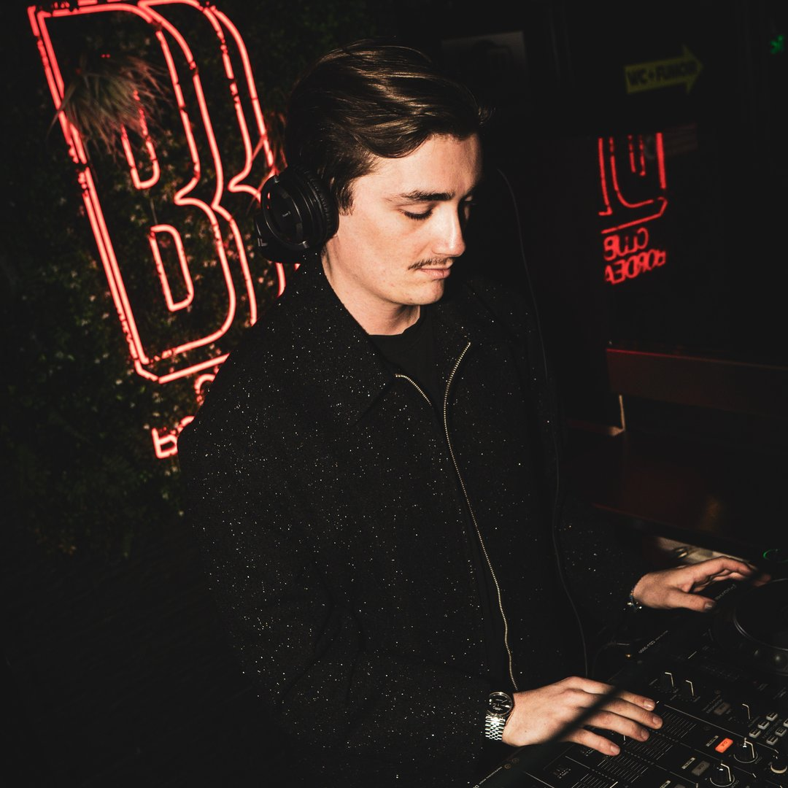

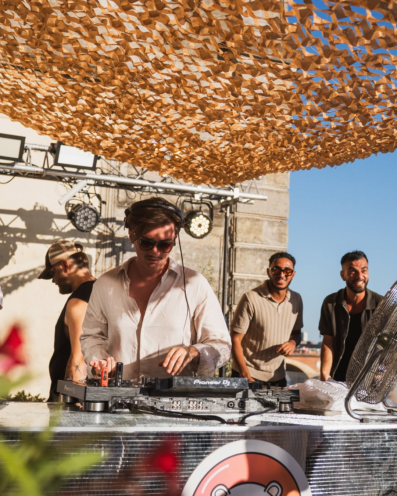

DJ Bordelais talentueux, Pierre a su **marquer la scène locale** en enchaînant les DJ sets dans les **lieux les plus prisés de Bordeaux :** Boom Boom Club, La Dame, Délirium, Bourbon, Belle En Folie, Bellaprem, Bao Refuge Festif, Pitchoun’, etc. 

🎶 **Un style caméléon** :

Polyvalent et intuitif, Pierre passe avec aisance de la T**ech House moderne** aux **classiques et remixes 80’s intemporels**, s’adaptant parfaitement à l’ambiance et aux attentes du public.

⚡ **Une ambiance toujours au rendez-vous** :

Que ce soit pour une **soirée chill entre amis ou une nuit sur le dancefloor**, il sait **créer l’atmosphère parfaite** où le public **danse, chante et vibre jusqu’au bout de la nuit**.

---

## Sébastien – DJ & Producteur de Musique

---

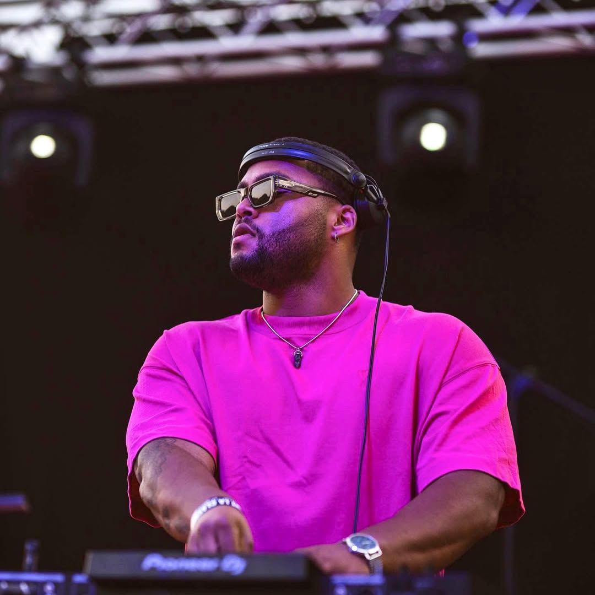

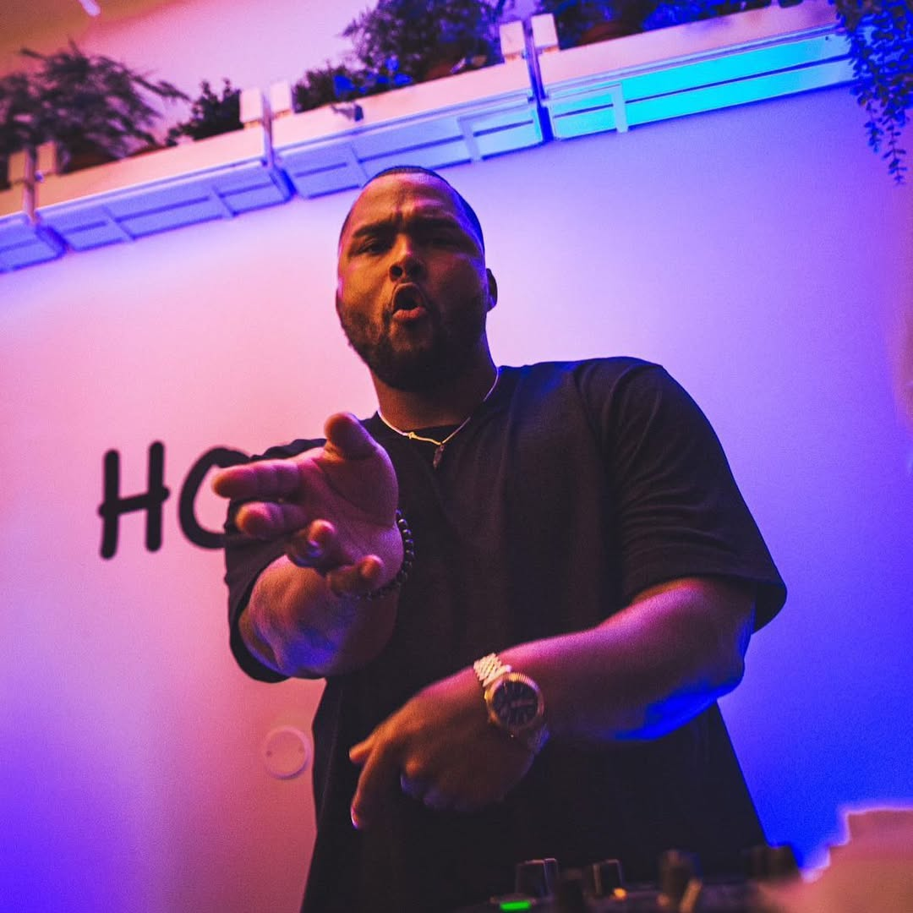

Sébastien est un DJ et producteur originaire du sud de la France, évoluant dans un univers **House groovy**, enrichi d’influences **disco, funk** et de grands classiques revisités. Son objectif : faire voyager le public et créer une immersion musicale fédératrice.

Reconnu pour sa **lecture du public** et sa capacité d’adaptation, Sébastien construit des sets élégants, dynamiques et accessibles, où l’énergie monte naturellement. Toujours à la recherche de la pépite qui fera la différence.

Binôme de **Hool**, il s’est produit sur des événements majeurs comme le **Delta Festival**, ainsi que dans des lieux tels que **Délirium Café Bordeaux, La Dame, Bourbon, La Belle en Folie**, et lors de nombreuses prestations privées et corporate.

---