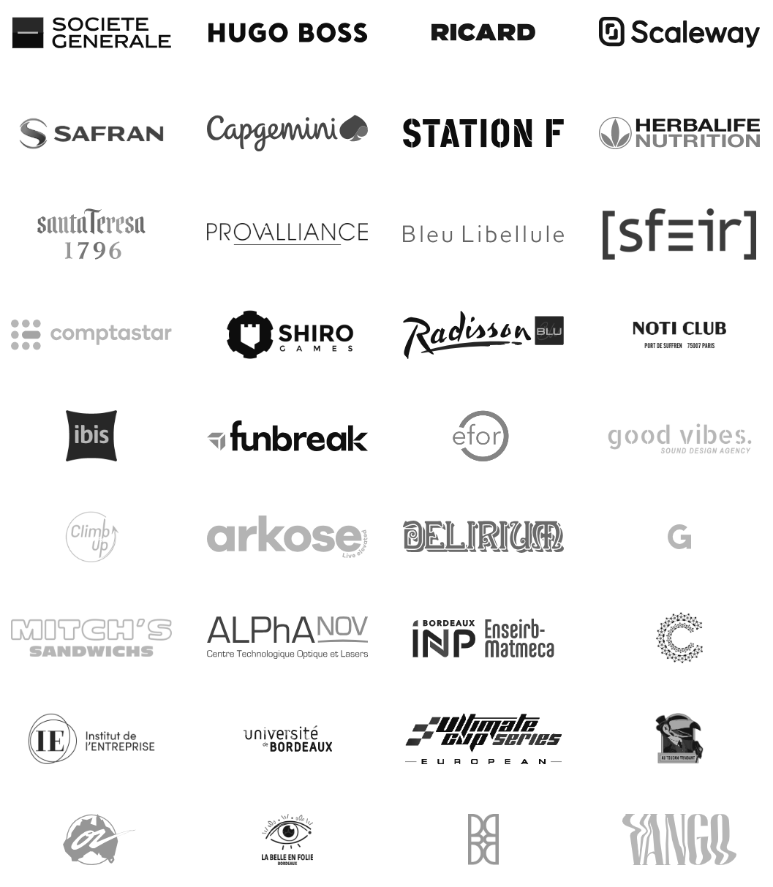

# Nos références

<aside>
🌍

Des grandes entreprises aux bars, clubs et institutions prestigieuses, VIBRA s'adapte à chaque contexte pour offrir des prestations de qualité, répondant aux besoins d'une clientèle variée.

</aside>

# **🎯** Ils nous ont déjà fait confiance

---

## Corporates

- Société Générale
- Hugo Boss
- Ricard
- Le Visionnaire L’Oréal
- Pommery
- Scaleway
- Safran
- Capgemini
- Station F
- Herbalife
- Santa Teresa
- Provalliance
- Bleu Libellule
- SFEIR
- Comptastar
- Shiro Games
- Hôtel Renaissance Mariott
- Hôtel Radison Blue
- Noti Plage
- ibis Hôtel
- The Coffee
- Vintage Group
- Funbreak
- Efor Group
- Caliceo
- Alegria
- Good Vibes Agency
- Climb’Up
- Arkose

## Bars & Clubs

- Délirium Café Bordeaux
- Vice Versa Paris & Marseille
- Gina Bordeaux
- Le Bourbon
- La Belle en Folie
- Oz Boat
- L’Engrenage
- L’Exception Cabaret
- Au Toucan Fringant
- Vango
- BMF
- Le Balthazar
- Grizzly Pub
- Sophia Cap Ferret
- Diego Arcachon
- Mitch’s Sandwichs
- La Tencha
- Eden Garden
- Chopes & Wines
- Cafe Rostand
- Le Pessàquai
- L’Exutoire
- Au Cellier

## Institutions

- **ai-**PULSE
- Cap Sciences
- Gendarmerie Nationale
- Alphanov
- Bordo FM
- Université de Bordeaux
- Bordeaux INP & Enseirb-Matmeca
- EBBS Business School
- Ultimate Cup Series
- Institut de l’Entreprise

## Associations & Autres

- DOJO
- Technivers
- Bordeaux accueil
- ATENA
- M’Tech
- Mass’Cot
- Espass

## Domaines, Châteaux & Lieux de réception

- Le Visionnaire (Siège L’Oréal)
- Château Lafitte (Yvrac)
- Domaine du Bijoutier (Lyon)
- Villa La Tosca (Arcachon)
- Domaine de Larchey (Saint-Médard-d'Eyrans)
- Château du Thil (Léognan)
- Domaine d’Arbis
- Croisières Burdigala II (Bordeaux)
- Château Flojague (Saint-Gènes-de-Castillon)
- Château Bernon (Queyrac)
- Château Pouzy et Bellevue (Cunèges)
- Manoir de Saint-Gervais
- Domaine les Gaillardoux (Montdoumerc)
- Espace Ventadour (Tulle)